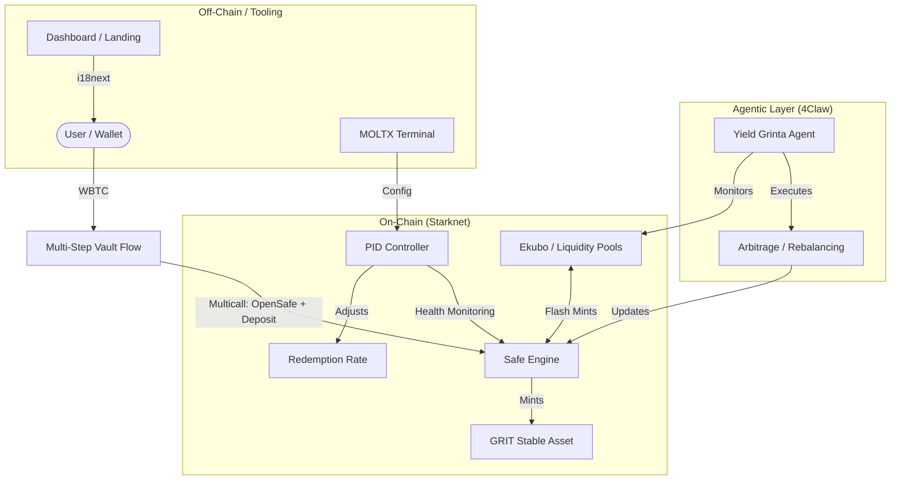

  
  # ⚡ Grinta Protocol
  ### The First Agentic BTCFi Protocol on Starknet

  
  
  
  

  [**Live Demo**]([https://mooltooj.vercel.app/](https://grinta-prototype-ui.vercel.app/)

---

## 📽️ Elevator Pitch
Grinta Protocol is a decentralized, agent-driven BTCFi ecosystem on Starknet. It allows WBTC holders to create high-efficiency collateralized debt positions (Vaults) to mint **GRIT** (a stable asset) while delegating asset management to autonomous agents. Our protocol balances capital preservation with institutional-grade yield strategies (arbitrage and flash-mints) powered by recursive AI agents.

## 🔴 The Problem: Passive BTC is "Dead Capital"
Bitcoin on Layer 2 often sits idle. While BTCFi is growing, users face a steep learning curve:
- **Complex Strategy Management**: Users must manually monitor health ratios and arbitrage opportunities.
- **Fragmentation**: Liquidity is scattered across pools with varying risk profiles.
- **Peg Instability**: Decentralized stable assets often struggle to maintain parity during BTC volatility.

## 🟢 The Solution: Grinta's Agentic Architecture
- **Autonomous Agentic Vaults**: Our "Yield Grinta" strategy uses on-chain agents to monitor Ekubo liquidity and execute real-time arbitrage.
- **PID-Controlled Stability**: A mathematical PID (Proportional-Integral-Derivative) controller constantly adjusts the redemption rate to maintain GRIT's peg.
- **Flash-Mint Native**: Optimized for leverage and nested yield strategies without high capital requirements.
- **Native Internationalization**: Built-in support for English, Spanish, and Portuguese to onboard the next billion users from Global South markets.

---

## 🏗️ Technical Architecture
Grinta Protocol's architecture is designed for modularity and high-performance execution on Starknet.

---

## 🛠️ Tech Stack
- **Frontend**: React 18, Vite, Framer Motion (premium animations).
- **Blockchain Interaction**: `@starknet-react/core`, `starknet.js`.
- **Internationalization**: `i18next` (English, Spanish, Portuguese).
- **Styling**: Vanilla CSS with modern "Glitch/Brutalist" design language.
- **State Management**: React Context (in-memory) + Starknet Hooks.
- **Contracts**: Cairo 1 (SafeEngine, SafeManager, PID Controller).

---

## 🗺️ Roadmap & Future Scope
- **Mainnet Launch**: Deployment of Audited SafeEngine on Starknet Mainnet.
- **Cross-Chain Expansion**: Integration with CCIP to allow BTC collateral from Bitcoin Mainnet.
- **Advanced Agent Market**: Allow 3rd party developers to deploy custom arbitrage agents (4Claw SDK).
- **Governance (gGRIT)**: DAO-governed PID parameters and yield distributions.

---

## 🤝 Team Reflecter Labs
- **Lead Dev**: [GitHub Profile]
- **Strategy Architect**: [GitHub Profile]

**Special Thanks to Starknet Foundation and the Hackathon Mentors.**

---

  
Built with ⚡ and Grinta on Starknet

