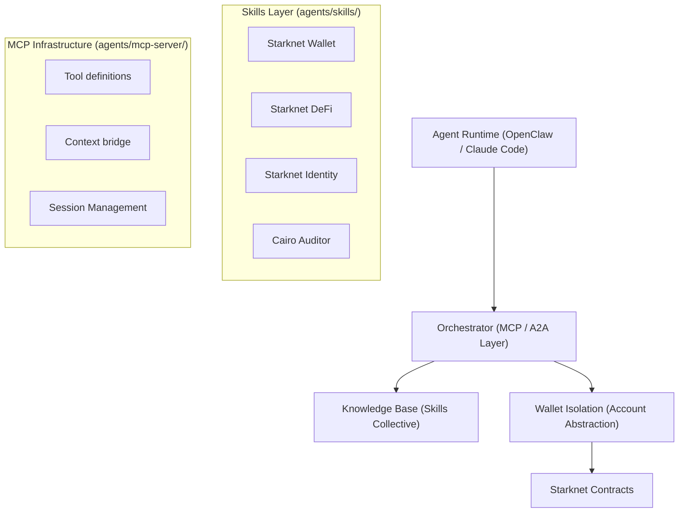

# Grinta Agentic Hub

An orchestration layer for AI agents built on Starknet, integrating the `keep-starknet-strange` ecosystem.

## Core Architecture


## Agent Workflows
- **Onboarding**: Uses `starkzap-sdk` and `onboarding-utils` for Web2 logins.
- **DeFi Execution**: Uses `starknet-defi` for optimized swaps and staking.
- **Security Safeguard**: Uses `cairo-auditor` and `cairo-security` before every transaction.
- **Identity & Reputation**: Uses `starknet-identity` (ERC-8004) to track agent reliability.

## Deployment Profile
- **Self-Custodial**: User owns the agent-account keys locally or via MCP proxy.
- **Deterministic**: Every action is simulated and validated against security skills.
- **Gasless**: Sponsored transactions via AVNU Paymaster integrated by default.

## Skill Installation
Add more skills from the collective using the [manifest.json](./skills/manifest.json):
```bash
# Skills added from:
# 1. keep-starknet-strange/starknet-agentic
# 2. keep-starknet-strange/starknet-skills
```
